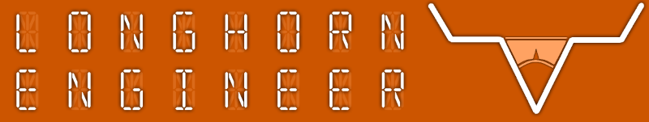

***
###Propeller_Development_Stick_Redux
***
**Tiny development board based on the Parallax Propeller.**

More information can be found on the [Propeller Development Stick project page](http://longhornengineer.com/projects/pcb/propeller-development-stick-redux/).

Board Files are for Cadsoft Eagle V6.0+

***
**License Information**

This project is under the [Creative Commons Attribution-ShareAlike 4.0 International License](LICENSE.md). These files are provided with no warranty and should be used at your own risk. 

***
